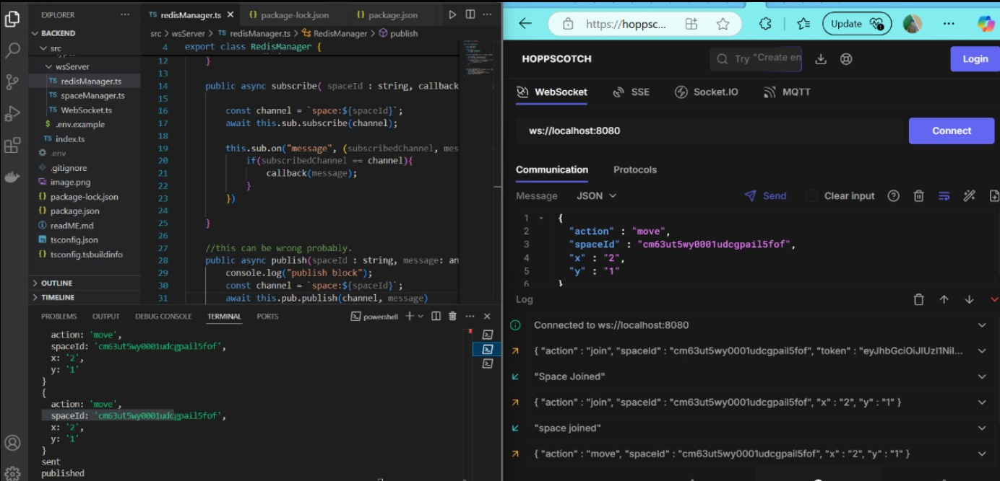

# Meta Backend

This is the backend for the **Metaverse-2d** project, a Gather.Town-like virtual workspace. The backend is responsible for handling user authentication, WebSocket connections, real-time space management, and database interactions. 

## 🚀 Tech Stack

- **Backend Framework**: Node.js with Express
- **Database**: PostgreSQL (via Prisma ORM)
- **WebSockets**: ws (WebSocket server for real-time updates)
- **Caching & Pub/Sub**: Redis (for event-driven architecture)
- **Authentication**: JWT-based authentication
- **ORM**: Prisma (PostgreSQL as the database)
- **Environment Variables Management**: dotenv

## 📂 Project Structure


```
meta-backend
│── assets/                 # Store images or assets (if needed)
│── dist/                   # Compiled TypeScript files
│── node_modules/           # Dependencies
│── src/                    # Source files
│   ├── db/                 # Database configuration
│   │   ├── prisma/         # Prisma ORM setup
│   │   ├── .env.example    # Environment variables example
│   │   ├── index.ts        # Database connection setup
│   ├── Routes/             # API routes
│   │   ├── authMiddlewares.ts  # Authentication middleware
│   │   ├── admin.ts         # Admin routes
│   │   ├── AuthRoutes.ts    # Authentication routes
│   │   ├── space.ts         # Space-related routes
│   │   ├── user.ts          # User-related routes
│   ├── types/              # TypeScript type definitions
│   │   ├── globalType.d.ts  # Global types
│   ├── wsServer/           # WebSocket Server
│   │   ├── redisManager.ts  # Redis pub/sub management
│   │   ├── spaceManager.ts  # Space management via WebSockets
│   │   ├── WebSocket.ts     # WebSocket connection handling
│   │   ├── index.ts         # WebSocket server setup
│── .env                    # Environment variables
│── .gitignore              # Files ignored in Git
│── image.png               # Project-related image
│── package.json            # Dependencies and scripts
│── package-lock.json       # Locked dependencies
│── readME.md               # Documentation
│── tsconfig.json           # TypeScript configuration
```

## 🔧 Setup & Installation

1. **Clone the repository**
   ```sh
   git clone https://github.com/mohakchakraborty2004/meta-backend.git
   cd meta-backend
   ```
2. **Install dependencies**
   ```sh
   npm install
   ```
3. **Set up environment variables**
   - Create a `.env` file in the root directory and add necessary environment variables (DB connection, JWT secret, etc.).
4. **Run database migrations**
   ```sh
   npx prisma migrate dev
   ```
5. **Start the backend server**
   ```sh
   npm run dev
   ```

## 🎥 Demo Video

https://github.com/user-attachments/assets/12bacf36-b311-43d0-84cc-6c5a1ea98b67

- [Frontend Implementation](https://github.com/mohakchakraborty2004/meta-frontend)


## 🖼️ Screenshots

### WebSocket Connections


## 📬 API Endpoints

### Authentication
- `POST /auth/register` - Register a new user
- `POST /auth/login` - Login user and get JWT token

### Spaces
- `POST /spaces/create` - Create a new space
- `GET /spaces/:id` - Get space details
- `POST /spaces/join` - Join a space

### WebSocket Actions
- **join** - Connects a user to a space
- **move** - Updates user position in real time

## 🔗 Contributing
If you want to contribute, feel free to fork the repo and submit a PR.

## 🛠 Future Enhancements
- Add more real-time interactions (e.g., object manipulation)
- Implement voice/video chat within spaces
- Optimize database queries for better performance

---
Made with ❤️ by [Mohak Chakraborty](https://github.com/mohakchakraborty2004)
